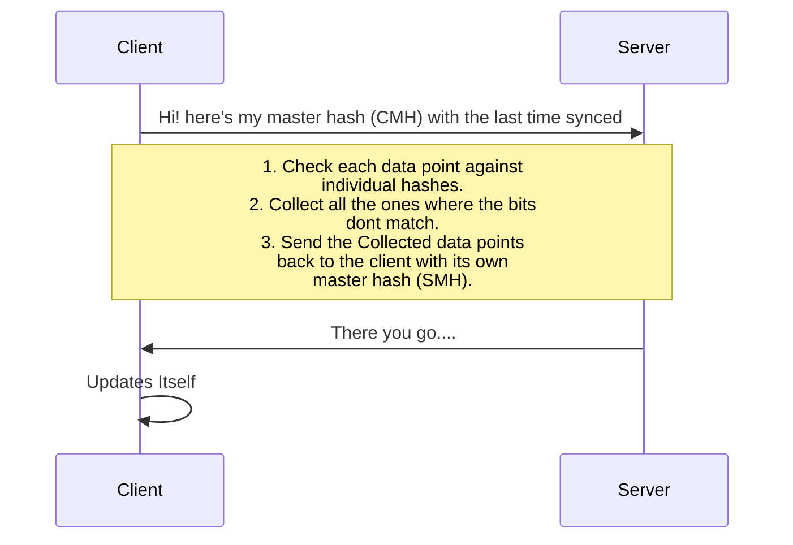

A bloom filter is a data structure which allows the server to sync data with a client with low data consumption. Another usecase is to find the uniqueness of the data. [Geekforgeeks](https://www.geeksforgeeks.org/bloom-filters-introduction-and-python-implementation/) has a pretty good explanation of bloom filters. 

This post addresses the syncing the data from the server to client. We  assume that the data on the client is already updating the server as and when the data is entered. The problem statement is not the unavailability or low availability of internet. Rather, it is to minimise the syncing operation involved.

The master hash is the ANDed product of all the individual hashes. The hashing function used here is the murmur hash which has great speed improvements over the normally used  SHA256. We shall use Node.js for our proof of concept.

**Writing a small proof of concept with existing libraries**  

From [Murmurhash-native](https://www.npmjs.com/package/murmurhash-native)'s npm page
```javascript
var  murmurHash  =  require('murmurhash-native').murmurHash
murmurHash( 'hash me!' ) // 2061152078
```

Now, using the same package, Lets hash a few strings:
```javascript
var  murmurHash  =  require('murmurhash-native').murmurHash

var  hash  =  murmurHash( 'hash me!' ) // 2061152078
console.log( hash );

var  hash2  =  murmurHash('do me too') // 3728646459
console.log(hash2);
``` 
Now we need to OR it since we need all the bits set from all the hashes. ORing it all together, we get:
```javascript
var  oredhash  =  hash  >>>  0  |  hash2  >>>  0 ;
oredhash  =  oredhash  >>>  0;
console.log(" Final hash : ",oredhash); // 4278103935
```
This is our Masterhash.

Now we create a few more hashes to check against the master hash.  we will create hashes for 2 strings, one of which is known to us and calclulated in the masterhash.

```javascript
var  testHash1  =  murmurHash('not me!') >>>  0
console.log(testHash1); //1542629515

// The Familiar one 
var  testHash2  =  murmurHash('do me too') >>>  0
console.log(testHash2); // 3728646459
```

 Now we need to check if the bits are set both in the individual hash as well as the master hash. Coding it up.....
 ```javascript
function  checkTheHashes( masterHash , hashToCheck ){
	var  check  = (masterHash  &  hashToCheck) >>>  0;
	//console.log(masterHash, hashToCheck, check);
	if (check  ==  hashToCheck) {
		return  true;
	} else {
		return  false;
	}
}
 ```

Lets run the function against the 2 hashes we created for checking against :

The `testHash1` should give a false since the data is not present in the masterhash
```javascript
check  =  checkTheHashes(oredhash, testHash1);
console.log(" checking hash \"not me!\" (should be false) : ",check); // false
```

The `testHash2` should give a true s
```javascript
check  =  checkTheHashes(oredhash, testHash2);
console.log(" checking hash \"do me too\" (should be true): ",check); // true
```
Now since i know it works, let me do the responsible thing and put it all in a class, so I dont pollute the global namespace.
```javascript
var bloomFilter = {
	masterHash : null,
	hashDataPoint : function( dataString ){
		hash = murmurHash( dataString ) >>>  0
		if( !isNull( masterHash )  ){
			this,masterHash = this.masterHash | hash ;
		} else {
			this.masterHash = hash;
		}
	},
	checkIfPresent : function( StringToCheck ){
	    hashToCheck = this.hashDataPoint(StringToCheck);
		var  check  = ( this.masterHash  &  hashToCheck) >>>  0;
		if (check  ==  hashToCheck) {
			return  true;
		} else {
			return  false;
		}
	}
}
``` 
I am going to use this class later.

As we can see, it is quite useful for 
1. checking uniqueness : where the answer for the `checkIfPresent` function is expected to be false.
2.  availability of the data: where the answer for the `checkIfPresent` function is expected to be true.


---
As we are concerned with syncing data between the server and client.

Here is how the interaction between the client/server will take place:


However, the server itself consists of 2 parts. the web server and the database server. 
The strategy for the maintaining the masterhash could be:
1.  Update the hash probably in a field in the same table. or a linked one.
2.  Continuously update the master hash with each insert or update.
3.  Periodically refresh the masterhash ( use a Cron! ) to ensure the deleted data also is reflected in the masterhash.

```SQL  
SELECT * FROM table_name HAVING hash_field_value & CMH <> hash_field_value
```  

The above SQL will return only those rows from the tablename which are not there or updated in the client system.


---


Some reading:
<https://developer.mozilla.org/en-US/docs/Web/JavaScript/Reference/Operators/Bitwise_Operators>

> Written with [StackEdit](https://stackedit.io/).
<!--stackedit_data:
eyJoaXN0b3J5IjpbMjAzMDU4NDI0LDIxMTY1NzUwMjAsMTkwOD
Q0NzYzNF19
-->